# Conflict Resolution & Retrospective Flows

This document describes the complete workflows for conflict resolution and retrospectives in the Morning Brief application.

## Table of Contents
- [Conflict Resolution Flow (Feelings-First)](#conflict-resolution-flow-feelings-first)
- [Retrospective Flow](#retrospective-flow)
- [State Machines](#state-machines)
- [Async Job Processing](#async-job-processing)

---

## Conflict Resolution Flow (Feelings-First)

The conflict resolution system uses a feelings-first approach where partners process their emotions with AI guidance before writing resolutions.

### High-Level Flow

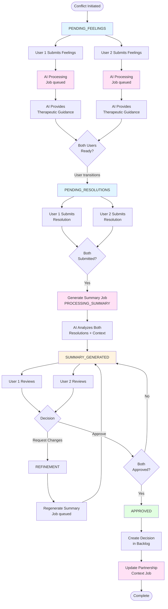

### Detailed State Transitions

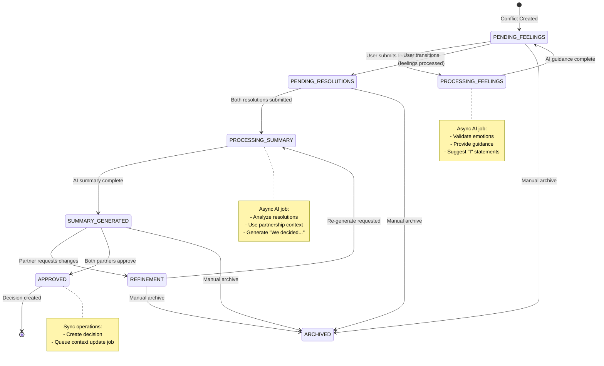

### Feelings Processing (AI as Personal Therapist)

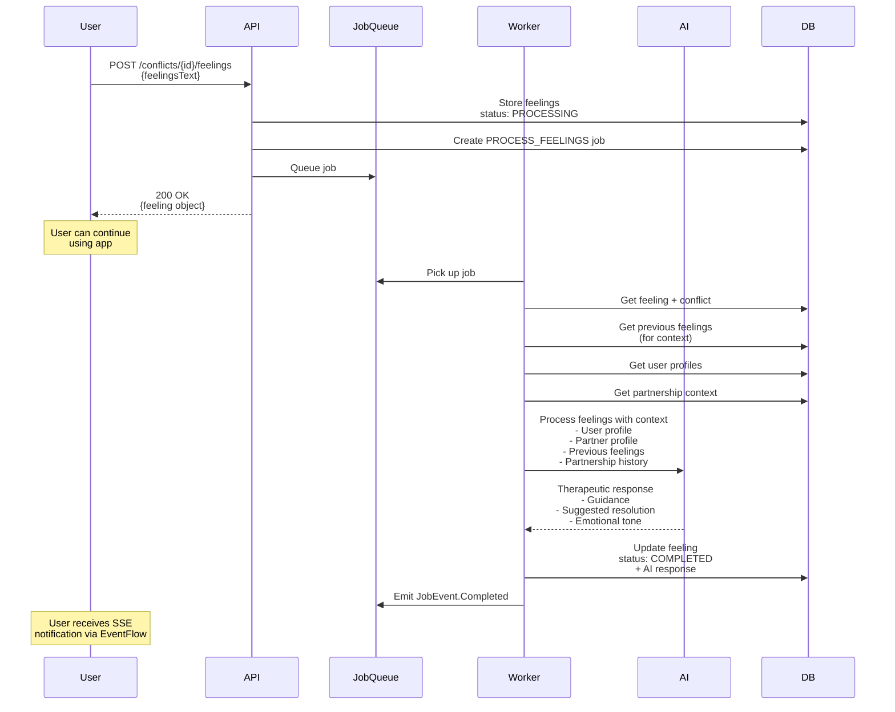

### Summary Generation (AI as Couples Therapist)

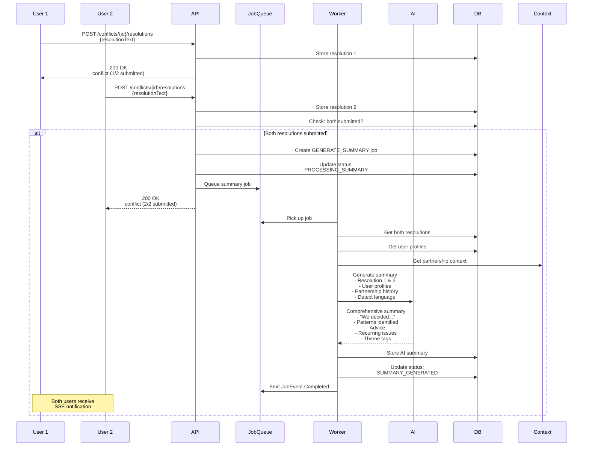

### Approval & Decision Creation

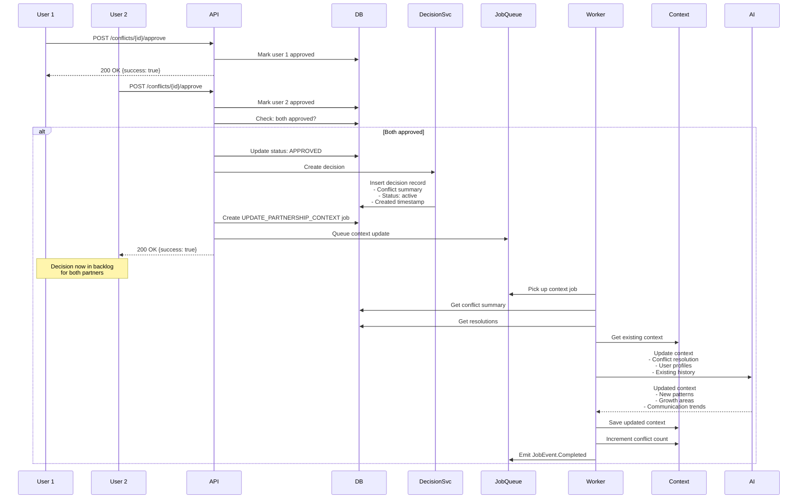

---

## Retrospective Flow

Retrospectives allow partners to review accumulated notes and create structured discussion points.

### High-Level Flow

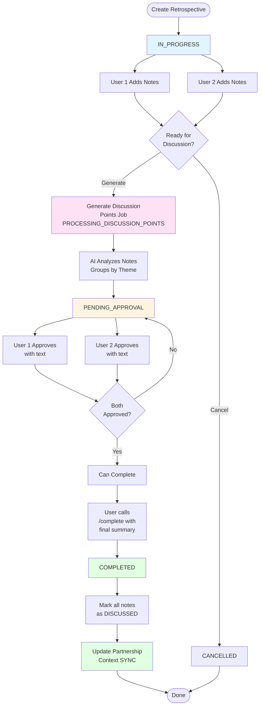

### Detailed State Transitions

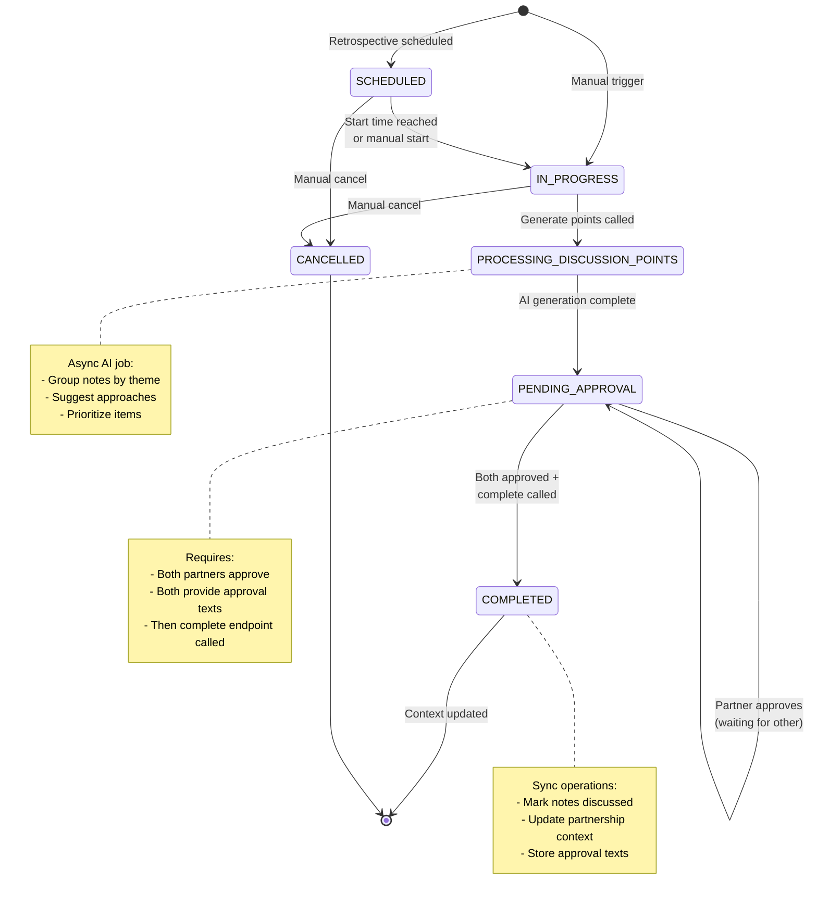

### Discussion Point Generation

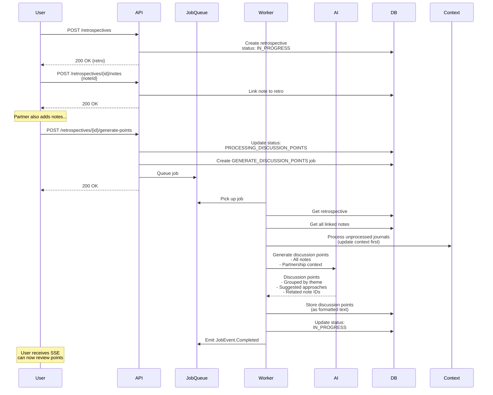

### Approval & Completion

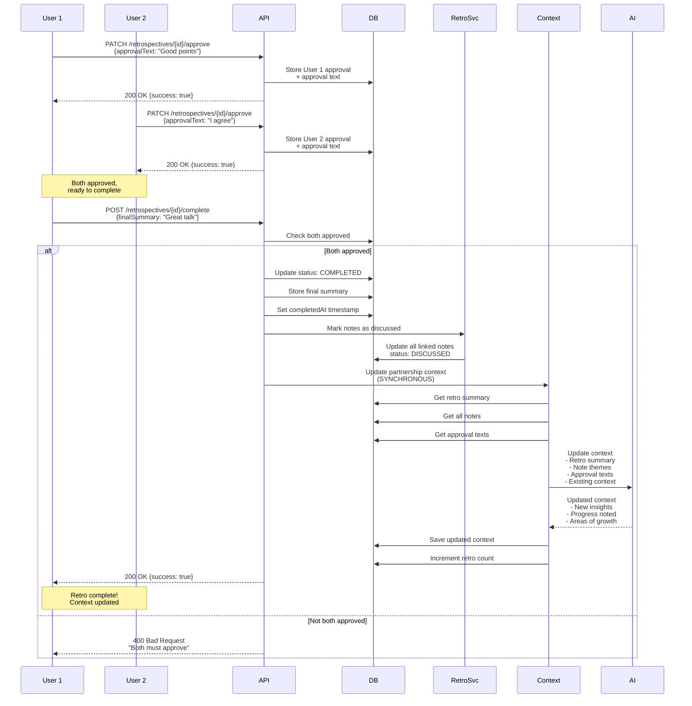

---

## State Machines

### Conflict Status State Machine

| Current Status | Valid Transitions | Trigger |
|---------------|-------------------|---------|
| `PENDING_FEELINGS` | `PENDING_RESOLUTIONS`, `ARCHIVED` | User action, manual archive |
| `PENDING_RESOLUTIONS` | `PROCESSING_SUMMARY`, `ARCHIVED` | Both resolutions submitted, manual archive |
| `PROCESSING_SUMMARY` | `SUMMARY_GENERATED` | AI job completes |
| `SUMMARY_GENERATED` | `REFINEMENT`, `APPROVED`, `ARCHIVED` | Request refinement, both approve, manual archive |
| `REFINEMENT` | `PROCESSING_SUMMARY`, `ARCHIVED` | Regenerate requested, manual archive |
| `APPROVED` | *(terminal)* | Decision created |
| `ARCHIVED` | *(terminal)* | N/A |

### Retrospective Status State Machine

| Current Status | Valid Transitions | Trigger |
|---------------|-------------------|---------|
| `SCHEDULED` | `IN_PROGRESS`, `CANCELLED` | Time reached/manual start, cancel |
| `IN_PROGRESS` | `PROCESSING_DISCUSSION_POINTS`, `CANCELLED` | Generate points, cancel |
| `PROCESSING_DISCUSSION_POINTS` | `IN_PROGRESS` | AI job completes |
| `IN_PROGRESS` (after points) | `COMPLETED`, `CANCELLED` | Both approved + complete called, cancel |
| `COMPLETED` | *(terminal)* | N/A |
| `CANCELLED` | *(terminal)* | N/A |

**Note:** The retrospective flow has a unique characteristic where it returns to `IN_PROGRESS` after discussion points are generated, allowing partners to review before approval.

---

## Async Job Processing

The application uses background job processing for AI operations to avoid blocking HTTP requests.

### Job Processing Architecture

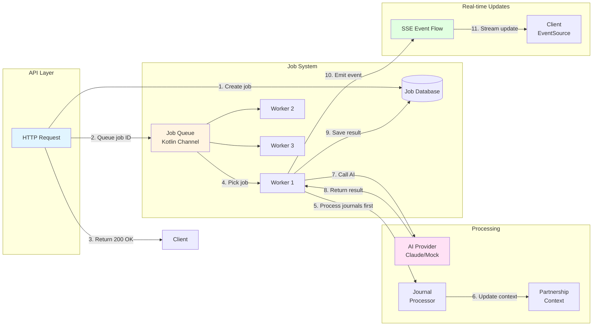

### Job Types & Processing

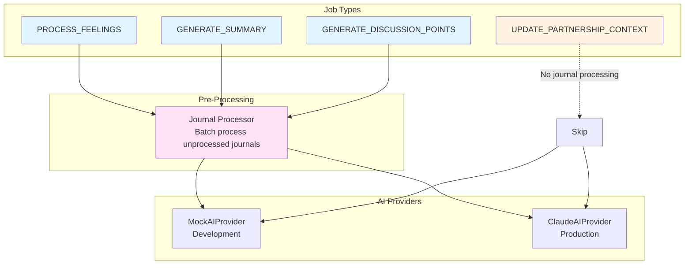

### Job Lifecycle

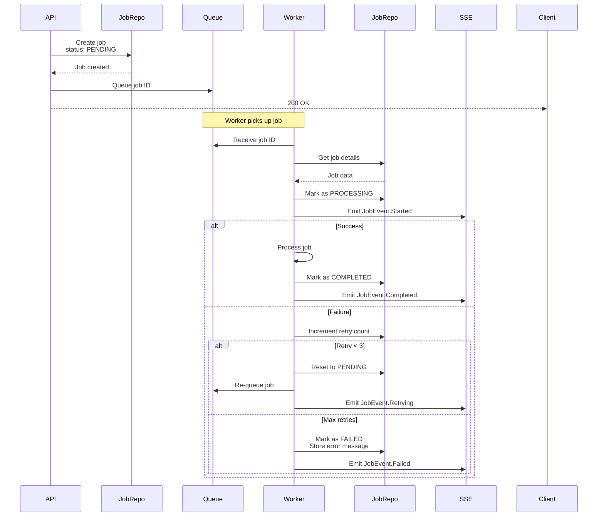

### SSE Event Flow

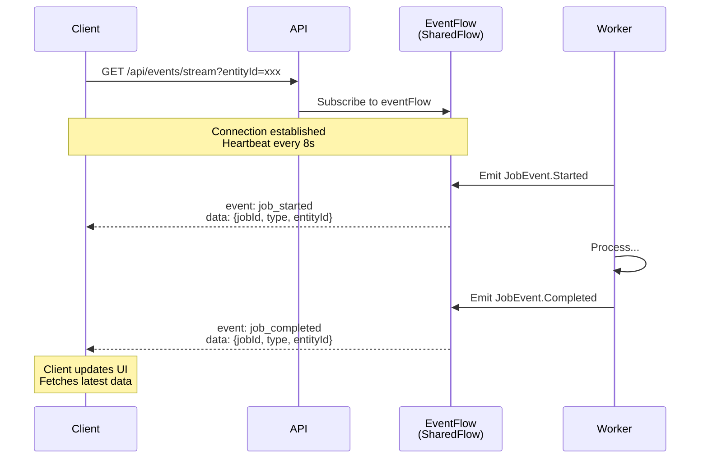

---

## Key Design Decisions

### 1. **Feelings-First Approach**
- Partners process emotions before writing solutions
- AI acts as personal therapist for each individual
- Reduces reactive, emotional responses
- Promotes healthy communication patterns

### 2. **Async AI Processing**
- HTTP requests return immediately (no 30s+ waits)
- Background workers process in parallel
- SSE provides real-time updates
- Retry logic handles transient failures

### 3. **Partnership Context**
- Maintains relationship history across all interactions
- AI uses context for personalized responses
- Updated after conflicts (async) and retros (sync)
- Includes patterns, growth areas, communication trends

### 4. **Journal Integration**
- Private journals processed in batch before AI calls
- Extracts insights without revealing specifics
- Enriches partnership context automatically
- Preserves privacy while improving AI responses

### 5. **Two-Phase Approval**
- Retrospectives require both partners to approve discussion points
- Then requires explicit complete call with final summary
- Approval texts provide context for future AI interactions
- Ensures both partners are aligned before finalizing

---

## Testing the Flows

### Using the Test DSL

```kotlin
// Conflict Resolution Flow
testApi(baseUrl, client) {
    partnership {
        users {
            // Create conflict and submit feelings
            val conflictId = user1.conflict {
                create()
                withFeelings("I feel unheard when...")
                returningId()
            }

            user2.conflict {
                fetch(conflictId)
                withFeelings("I feel overwhelmed by...")
            }

            // Wait for transition to resolutions phase
            user1.waitForConflictStatus(conflictId, ConflictStatus.PENDING_RESOLUTIONS)

            // Submit resolutions
            user1.submitResolution(conflictId, "I will...")
            user2.submitResolution(conflictId, "We should...")

            // Wait for AI summary
            user1.waitForConflictStatus(conflictId, ConflictStatus.SUMMARY_GENERATED)

            // Review and approve
            user1.approveSummary(conflictId)
            user2.approveSummary(conflictId)

            // Wait for approval
            user1.waitForConflictStatus(conflictId, ConflictStatus.APPROVED)

            // Verify decision created
            user1.decisions {
                isNotEmpty()
                hasCount(1)
            }
        }
    }
}

// Retrospective Flow
testApi(baseUrl, client) {
    partnership {
        users {
            // Create notes
            val note1 = user1.note("We need to discuss chores").note
            val note2 = user2.note("Want to plan date nights").note

            // Create retro and add notes
            val retroId = user1.retrospective {
                create()
                addNote(note1.id)
                returningId()
            }

            user2.retrospective {
                fetch(retroId)
                addNote(note2.id)
            }

            // Generate discussion points (async)
            user1.retrospective {
                fetch(retroId)
                generatePoints()
            }

            // Both approve
            user1.approveRetro(retroId, "These look good")
            user2.approveRetro(retroId, "I agree, let's discuss")

            // Complete
            user1.completeRetro(retroId, "Great conversation!")

            // Verify completion
            user1.retrospective {
                fetch(retroId)
                assertState {
                    isCompleted()
                    hasSummary("Great conversation!")
                }
            }
        }
    }
}
```

---

## Monitoring & Observability

### Job Status Tracking

```kotlin
// Check job status
val job = user.getJobStatus(jobId)
println("Job ${job.id}: ${job.status}")

// Subscribe to SSE for real-time updates
// GET /api/events/stream?entityId={conflictId}
// Receives:
// - job_started
// - job_completed
// - job_failed
// - job_retrying
```

### Logging Points

1. **Job Lifecycle**: JobProcessorService logs all job state changes
2. **AI Interactions**: All AI provider calls are logged with context
3. **State Transitions**: Conflict and retro status changes are logged
4. **Errors**: Failed jobs include full error messages and stack traces

---

## Future Enhancements

1. **Parallel Feelings Processing**: Allow partners to view each other's feelings before transitioning
2. **Discussion Point Refinement**: Allow partners to request changes to discussion points
3. **Progress Tracking**: Show completion percentage for multi-step flows
4. **Scheduled Retrospectives**: Automatic retro creation on schedule
5. **Conflict Templates**: Pre-defined conflict types with guided flows
6. **AI Coaching**: Proactive suggestions based on partnership patterns

---

## Related Documentation

- [API Documentation](../README.md) - Complete API endpoint reference
- [CLAUDE.md](../../CLAUDE.md) - Full system architecture and design decisions
- [Test DSL Guide](../src/test/kotlin/integration/dsl/README.md) - Writing integration tests
